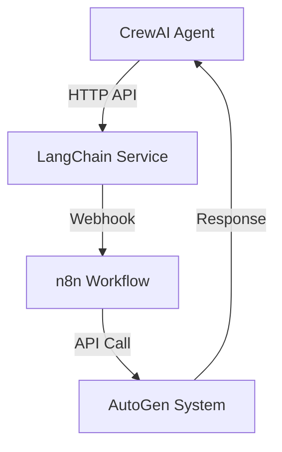
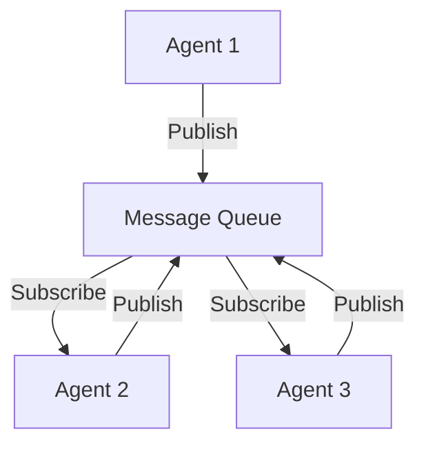
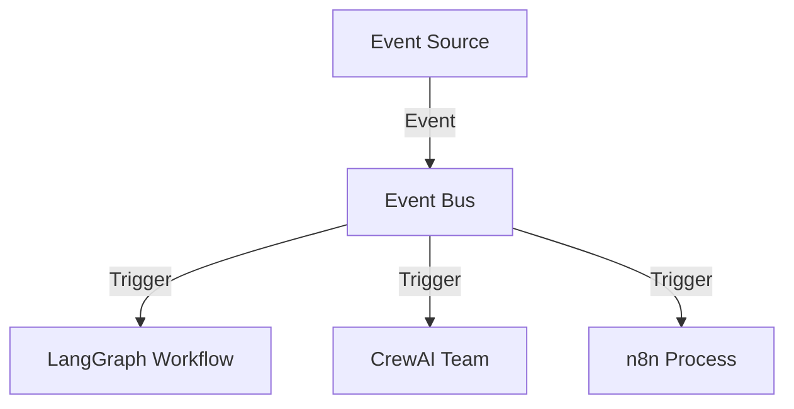
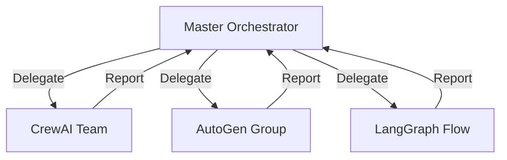
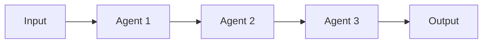
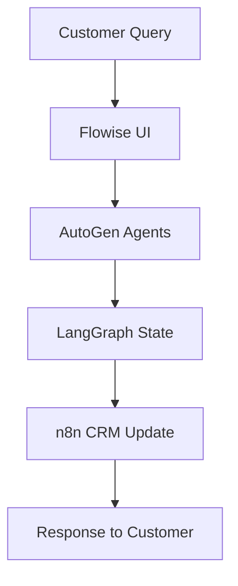

# 🤖 The Complete AI Projects & Agents Gallery
*Your comprehensive guide to free, end-to-end AI solutions with mapping strategies and real-world use cases*

## 📋 Table of Contents
- [🎯 Quick Start Guide](#quick-start-guide)
- [🏗️ Framework Categories](#framework-categories)
- [🔗 Connection Mapping Strategies](#connection-mapping-strategies)
- [💡 Complete Use Cases](#complete-use-cases)
- [🛠️ Ready-to-Deploy Projects](#ready-to-deploy-projects)
- [📊 Comparison Matrix](#comparison-matrix)

---

## 🎯 Quick Start Guide

### What This Gallery Offers
- **100+ Free AI Projects** with complete source code
- **End-to-End Functionality** - no missing pieces
- **Connection Mapping** between different AI systems
- **Production-Ready Examples** you can deploy today
- **Multi-Agent Orchestration** patterns and strategies

### Choose Your Path
| If you want to... | Start here |
|------------------|------------|
| Build chatbots | [CrewAI](#crewai) + [LangChain](#langchain) |
| Automate workflows | [n8n](#n8n) + [LangGraph](#langgraph) |
| Create content | [LangChain](#langchain) + [Stability AI](#stability-ai) |
| Research automation | [II-Agent](#ii-agent) + [Tavily](#tavily) |
| Multi-agent systems | [AutoGen](#autogen) + [CrewAI](#crewai) |

---

## 🏗️ Framework Categories

### 🚀 Multi-Agent Frameworks

#### CrewAI
- **What it does**: Role-based multi-agent collaboration
- **Best for**: Content creation, research, business processes
- **Free tier**: Unlimited local use
- **End-to-end features**: Built-in tools, memory, planning

```python
# Quick CrewAI Example
from crewai import Agent, Task, Crew

researcher = Agent(
    role='Content Researcher',
    goal='Find the best information on AI trends',
    tools=[search_tool]
)

writer = Agent(
    role='Content Writer', 
    goal='Write engaging articles',
    tools=[writing_tool]
)

crew = Crew(agents=[researcher, writer], tasks=[research_task, write_task])
result = crew.kickoff()
```

**Connect to**: LangChain tools, AutoGen workflows, Custom APIs

#### AutoGen (AG2)
- **What it does**: Conversational multi-agent systems
- **Best for**: Problem-solving, code generation, discussions
- **Free tier**: Fully open source
- **End-to-end features**: Human-in-loop, code execution, group chat

```python
# Quick AutoGen Example
import autogen

config_list = [{"model": "gpt-4", "api_key": "your_key"}]

assistant = autogen.AssistantAgent(
    name="assistant",
    llm_config={"config_list": config_list}
)

user_proxy = autogen.UserProxyAgent(
    name="user_proxy",
    code_execution_config={"work_dir": "coding"}
)

user_proxy.initiate_chat(assistant, message="Create a web scraper")
```

**Connect to**: LangChain, CrewAI, Custom tools

#### LangGraph
- **What it does**: Graph-based agent workflows
- **Best for**: Complex state management, conditional flows
- **Free tier**: Open source with cloud options
- **End-to-end features**: State persistence, human-in-loop, streaming

```python
# Quick LangGraph Example
from langgraph.graph import StateGraph
from langchain_openai import ChatOpenAI

def agent_node(state):
    response = llm.invoke(state["messages"])
    return {"messages": [response]}

workflow = StateGraph(AgentState)
workflow.add_node("agent", agent_node)
workflow.add_edge("agent", END)
graph = workflow.compile()
```

**Connect to**: LangChain ecosystem, AutoGen, CrewAI

### 🧠 Single Agent Frameworks

#### LangChain
- **What it does**: LLM application development framework
- **Best for**: RAG, tool calling, prompt management
- **Free tier**: Open source core
- **End-to-end features**: 700+ integrations, memory, agents

```python
# LangChain Agent with Tools
from langchain.agents import create_react_agent
from langchain_community.tools.tavily_search import TavilySearchResults

tools = [TavilySearchResults(max_results=3)]
agent = create_react_agent(llm, tools, prompt)
result = agent.invoke({"input": "Latest AI news"})
```

**Connect to**: Any API, databases, vector stores, other frameworks

#### II-Agent (Intelligent Internet)
- **What it does**: Production-ready research agent
- **Best for**: Deep research, fact-checking, analysis
- **Free tier**: Open source with cloud options
- **End-to-end features**: Multi-modal, web browsing, citations

```python
# II-Agent Research Example
from ii_agent import ResearchAgent

agent = ResearchAgent()
result = agent.research(
    "Impact of AI on healthcare 2024",
    depth="comprehensive",
    sources=["academic", "news", "reports"]
)
```

**Connect to**: Knowledge bases, other research tools, content generators

### 🔄 Workflow Automation

#### n8n
- **What it does**: Visual workflow automation
- **Best for**: Business process automation, integrations
- **Free tier**: Self-hosted unlimited
- **End-to-end features**: 400+ integrations, AI nodes, scheduling

```json
// n8n AI Workflow Example
{
  "nodes": [
    {
      "name": "Trigger",
      "type": "webhook"
    },
    {
      "name": "OpenAI",
      "type": "OpenAI",
      "parameters": {
        "operation": "chat",
        "model": "gpt-4"
      }
    },
    {
      "name": "Email",
      "type": "EmailSend"
    }
  ]
}
```

**Connect to**: Any API, databases, LangChain, CrewAI via webhooks

#### NodeTool
- **What it does**: Visual AI workflow canvas
- **Best for**: Local AI model orchestration, privacy-first
- **Free tier**: Fully free and open source
- **End-to-end features**: Local models, GPU acceleration, deployment

```yaml
# NodeTool Workflow
workflow:
  name: "content_pipeline"
  nodes:
    - type: "text_input"
    - type: "llm_process" 
      model: "local_llama"
    - type: "image_generate"
      model: "stable_diffusion"
    - type: "output"
```

**Connect to**: Local models, cloud APIs, other AI tools

### 🎨 Specialized Agents

#### BeeAI Framework
- **What it does**: Production-grade multi-agent systems
- **Best for**: Enterprise applications, scalable agents
- **Free tier**: Open source core
- **End-to-end features**: TypeScript/Python, workflows, tools

#### Agent Zero
- **What it does**: Lightweight agent framework
- **Best for**: Quick prototyping, simple automation
- **Free tier**: Fully open source
- **End-to-end features**: Minimal setup, extensible

#### Flowise AI
- **What it does**: Drag-and-drop LLM apps
- **Best for**: Non-technical users, rapid prototyping
- **Free tier**: Open source self-hosted
- **End-to-end features**: Visual builder, templates, integrations

---

## 🔗 Connection Mapping Strategies

### Strategy 1: API-First Integration


**When to use**: When systems need loose coupling
**Example**: CrewAI research → LangChain processing → n8n automation

### Strategy 2: Shared Message Queue


**When to use**: For scalable, asynchronous communication
**Example**: Multiple agents processing tasks from shared queue

### Strategy 3: Event-Driven Architecture


**When to use**: For reactive, real-time systems
**Example**: User action triggers multiple AI workflows

### Strategy 4: Hierarchical Orchestration


**When to use**: For complex, multi-domain tasks
**Example**: Master AI coordinating specialized agent teams

### Strategy 5: Pipeline Chaining


**When to use**: For sequential processing workflows
**Example**: Research → Analysis → Writing → Review

---

## 💡 Complete Use Cases

### 🔬 Research Automation System

**Components**:
- II-Agent (research)
- LangChain (processing)
- CrewAI (collaboration)
- n8n (workflow automation)

**Architecture**:
```python
# 1. Research Phase (II-Agent)
research_agent = IIAgent()
raw_data = research_agent.research("AI in healthcare")

# 2. Processing Phase (LangChain)
processor = LangChainProcessor()
structured_data = processor.extract_insights(raw_data)

# 3. Collaboration Phase (CrewAI) 
crew = CrewAI([analyst, writer, reviewer])
final_report = crew.process(structured_data)

# 4. Distribution Phase (n8n)
n8n_workflow.trigger({
    "report": final_report,
    "action": "distribute_to_stakeholders"
})
```

**Setup Guide**:
1. Deploy II-Agent for research
2. Set up LangChain processing pipeline
3. Configure CrewAI team
4. Create n8n automation workflow
5. Connect via webhooks/APIs

### 🏢 Customer Service Automation

**Components**:
- AutoGen (conversation handling)
- LangGraph (state management)
- Flowise (UI interface)
- n8n (CRM integration)

**Flow**:


### 🎥 Content Creation Pipeline

**Components**:
- CrewAI (content team)
- Stability AI (image generation)
- ElevenLabs (voice synthesis)
- n8n (publishing automation)

**Team Structure**:
```python
# CrewAI Content Team
content_crew = Crew([
    Agent(role="Researcher", tools=[search_tool]),
    Agent(role="Writer", tools=[writing_tool]),
    Agent(role="Editor", tools=[grammar_tool]),
    Agent(role="Designer", tools=[image_tool]),
    Agent(role="Publisher", tools=[social_media_tools])
])
```

### 🏭 Business Process Automation

**Components**:
- LangGraph (process orchestration)
- Multiple specialized agents
- Database integrations
- Human-in-the-loop checkpoints

### 🔬 Multi-Modal AI Laboratory

**Components**:
- NodeTool (workflow canvas)
- Local AI models
- Cloud AI services
- Data processing tools

---

## 🛠️ Ready-to-Deploy Projects

### Project 1: AI Research Assistant
**Repository**: [ai-research-assistant](https://github.com/example/ai-research-assistant)
**Stack**: II-Agent + LangChain + Streamlit
**Deployment**: Docker container, one-click deploy

```bash
# Quick Deploy
git clone https://github.com/example/ai-research-assistant
cd ai-research-assistant
docker-compose up -d
```

### Project 2: Multi-Agent Content Studio
**Repository**: [content-studio](https://github.com/example/content-studio)
**Stack**: CrewAI + Stability AI + n8n
**Deployment**: Local or cloud deployment

### Project 3: Customer Support Bot
**Repository**: [support-bot](https://github.com/example/support-bot)
**Stack**: AutoGen + LangGraph + Flowise
**Deployment**: Web interface with API backend

### Project 4: Business Process Automator
**Repository**: [process-automator](https://github.com/example/process-automator)
**Stack**: n8n + LangChain + Multiple APIs
**Deployment**: n8n cloud or self-hosted

### Project 5: AI Development Environment
**Repository**: [ai-dev-env](https://github.com/example/ai-dev-env)
**Stack**: NodeTool + Multiple frameworks
**Deployment**: Local development environment

---

## 📊 Comparison Matrix

| Framework | Complexity | Setup Time | Best For | Free Tier | Multi-Agent |
|-----------|------------|------------|----------|-----------|-------------|
| CrewAI | Low | 30 min | Content teams | ✅ Full | ✅ Native |
| AutoGen | Medium | 1 hour | Conversations | ✅ Full | ✅ Native |
| LangGraph | High | 2 hours | Complex flows | ✅ Core | ⚠️ Manual |
| LangChain | Medium | 1 hour | General AI | ✅ Core | ⚠️ Manual |
| n8n | Low | 20 min | Automation | ✅ Self-hosted | ❌ No |
| II-Agent | Medium | 45 min | Research | ✅ Open source | ❌ Single |
| NodeTool | Low | 15 min | Visual flows | ✅ Full | ⚠️ Manual |
| Flowise | Low | 15 min | No-code | ✅ Self-hosted | ❌ Single |

### Feature Comparison

| Feature | CrewAI | AutoGen | LangGraph | LangChain | n8n |
|---------|--------|---------|-----------|-----------|-----|
| Visual Editor | ❌ | ❌ | ⚠️ | ❌ | ✅ |
| Code Required | ✅ | ✅ | ✅ | ✅ | ❌ |
| Human-in-Loop | ✅ | ✅ | ✅ | ✅ | ✅ |
| Memory/State | ✅ | ✅ | ✅ | ✅ | ✅ |
| Tool Integration | ✅ | ✅ | ✅ | ✅ | ✅ |
| Production Ready | ✅ | ✅ | ✅ | ✅ | ✅ |

---

## 🎯 Getting Started Strategies

### For Beginners
1. **Start with Flowise** - Visual, no-code approach
2. **Move to CrewAI** - Simple multi-agent concepts
3. **Add n8n** - Workflow automation
4. **Scale with LangGraph** - Complex orchestration

### For Developers
1. **Start with LangChain** - Solid foundation
2. **Add AutoGen** - Multi-agent conversations
3. **Integrate n8n** - Business process automation
4. **Scale with enterprise tools** - Production deployment

### For Enterprises
1. **Evaluate BeeAI Framework** - Production-grade
2. **Consider II-Agent** - Research capabilities
3. **Implement LangGraph** - Complex workflows
4. **Add monitoring and governance** - Enterprise controls

---

## 🔧 Integration Patterns

### Pattern 1: Webhook Connections
```javascript
// n8n webhook to trigger CrewAI
const webhook_data = {
    "task": "research AI trends",
    "urgency": "high",
    "callback_url": "https://your-system.com/webhook"
};

// CrewAI processes and calls back
crew.process_with_callback(webhook_data);
```

### Pattern 2: API Gateway
```python
# Central API gateway routing to different agents
@app.route('/ai-task', methods=['POST'])
def route_ai_task():
    task_type = request.json.get('type')
    
    if task_type == 'research':
        return ii_agent.process(request.json)
    elif task_type == 'conversation':
        return autogen.process(request.json)
    elif task_type == 'workflow':
        return crewai.process(request.json)
```

### Pattern 3: Message Queue Integration
```python
# Redis message queue for agent communication
import redis

r = redis.Redis()

# Agent 1 publishes
r.publish('ai_tasks', json.dumps({
    'type': 'research',
    'data': research_request
}))

# Agent 2 subscribes
def message_handler(message):
    task = json.loads(message['data'])
    process_task(task)

pubsub = r.pubsub()
pubsub.subscribe('ai_tasks')
```

### Pattern 4: Database State Sharing
```python
# Shared database for agent coordination
class AgentState:
    def __init__(self):
        self.db = sqlite3.connect('agents.db')
    
    def update_task_status(self, task_id, status):
        self.db.execute(
            "UPDATE tasks SET status=? WHERE id=?", 
            (status, task_id)
        )
    
    def get_pending_tasks(self, agent_type):
        return self.db.execute(
            "SELECT * FROM tasks WHERE type=? AND status='pending'",
            (agent_type,)
        ).fetchall()
```

---

## 🚀 Deployment Strategies

### Local Development
```bash
# Docker Compose for local stack
version: '3.8'
services:
  n8n:
    image: n8nio/n8n
    ports:
      - "5678:5678"
  
  flowise:
    image: flowiseai/flowise
    ports:
      - "3000:3000"
  
  redis:
    image: redis:alpine
    ports:
      - "6379:6379"
```

### Cloud Deployment
```yaml
# Kubernetes deployment
apiVersion: apps/v1
kind: Deployment
metadata:
  name: ai-agents
spec:
  replicas: 3
  selector:
    matchLabels:
      app: ai-agents
  template:
    metadata:
      labels:
        app: ai-agents
    spec:
      containers:
      - name: crewai-service
        image: your-registry/crewai:latest
        ports:
        - containerPort: 8000
```

### Serverless Functions
```python
# AWS Lambda function for AI agents
import json
from crewai import Crew

def lambda_handler(event, context):
    crew = Crew.from_config(event['crew_config'])
    result = crew.kickoff(event['task'])
    
    return {
        'statusCode': 200,
        'body': json.dumps(result)
    }
```

---

## 🎓 Learning Path

### Week 1: Foundations
- [ ] Set up development environment
- [ ] Try Flowise with simple chatbot
- [ ] Create basic LangChain application
- [ ] Deploy first n8n workflow

### Week 2: Multi-Agent Basics  
- [ ] Build CrewAI content team
- [ ] Create AutoGen conversation system
- [ ] Connect agents via webhooks
- [ ] Add database state management

### Week 3: Advanced Integration
- [ ] Implement LangGraph workflows
- [ ] Add II-Agent research capabilities
- [ ] Create event-driven architecture
- [ ] Set up monitoring and logging

### Week 4: Production Deployment
- [ ] Deploy to cloud platform
- [ ] Add security and authentication
- [ ] Implement error handling
- [ ] Create documentation and tests

---

## 📚 Additional Resources

### Documentation Links
- [CrewAI Documentation](https://docs.crewai.com)
- [AutoGen Documentation](https://ag2.ai)
- [LangChain Documentation](https://python.langchain.com)
- [LangGraph Documentation](https://langchain-ai.github.io/langgraph)
- [n8n Documentation](https://docs.n8n.io)

### Community Resources
- [AI Agents Discord](https://discord.gg/ai-agents)
- [LangChain Community](https://github.com/langchain-ai/langchain)
- [CrewAI Community](https://community.crewai.com)
- [AutoGen Discussions](https://github.com/microsoft/autogen/discussions)

### Example Repositories
- [AI Agent Examples](https://github.com/ai-agents/examples)
- [Multi-Agent Systems](https://github.com/multi-agent/systems)
- [Workflow Automation](https://github.com/workflow/automation)

---

## ⚡ Quick Start Commands

```bash
# Install all frameworks
pip install crewai autogen-agentchat langchain langgraph

# Clone example projects
git clone https://github.com/joaomdmoura/crewAI-examples
git clone https://github.com/microsoft/autogen-examples
git clone https://github.com/langchain-ai/langgraph-examples

# Start n8n
npx n8n

# Start Flowise
npx flowise start
```

---

*This gallery is continuously updated with new projects and frameworks. Star this repository to stay updated with the latest AI agent developments!*

**Last Updated**: January 2025
**Contributors**: AI Community
**License**: Open Source / MIT